## GENERAL NOTES
Add a filter to filter things from non officialy palyabel sources, such as legeneds

## Factions
Has simpel information about the faction

id: the string identifyioen the faction
name: name of the faction
link: link to the faction on wahapedia

## Source
Has the information on where the different rules and other stuff on wahapedia is from.

only the following fields, are relevant
id, type

id: the id of the source
name: the name of the rules
type: the type of the rules e.g. index, codex expansion.
as far as I can see everything excepr index and codex, are not playabel in officaly turnaments,  
edition: the edetion of the rules
version: the version of the rules
errata_date: the date when it was added to wahapedia
errata_link: the link to where its saved

## Datasheets
Has general information about the datasheets, and how they are related to other tabels

id: the id for the datasheet
name: name of the datasheet
faction_id: the id of the faction of the datasheet conected to the faction tabel
source_id: the source id of the datasheet conected to the source tabel
legend: fluff text for the datasheet
role: what role the datasheet is, battle line, character, etc.
loadout: the standart loadout of the datasheet, its written in html format
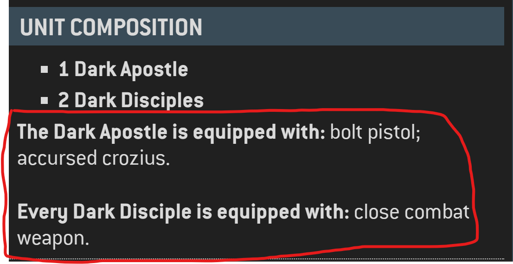
transport: the transport capcity if its a transport, written as html format, with styling from the website
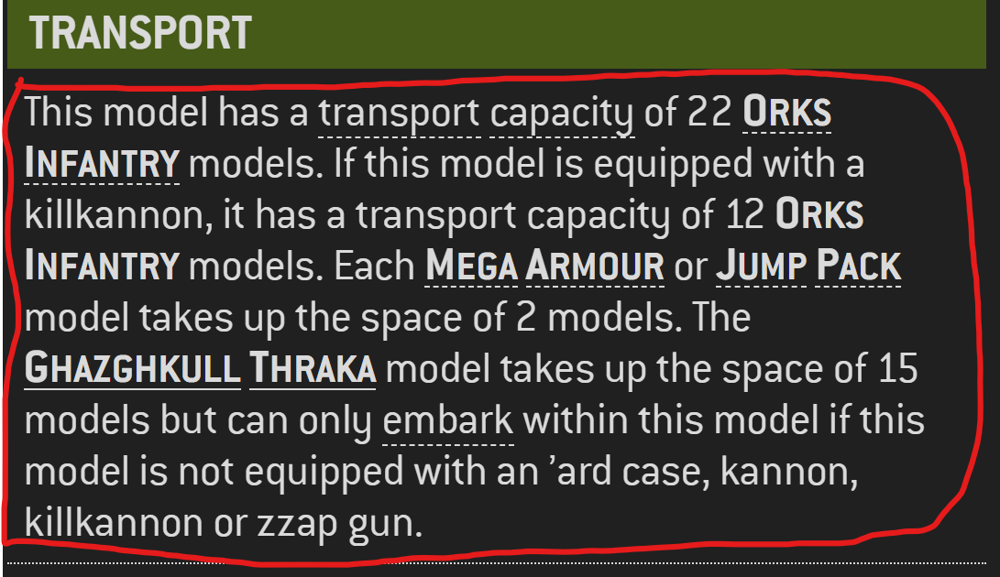
virtual: a bool for somtehing, not quite sure what, but its only 3 datasheets that have it, but cant find those datasheets on the website. Should proabelry not load the datasheets that has it as true.
leader_head: Leader section header commentary, cant find any datasheets that have it, so proabelry noit relevant.
leader_footer: Leader section footer commentary, if the unit is a leader, its written in html format with styilng from the website.
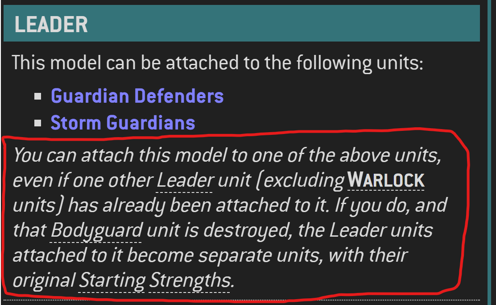
damaged_w: for units that has a speciel effect when damaged
damaged_description: what effect the unit has when damaged
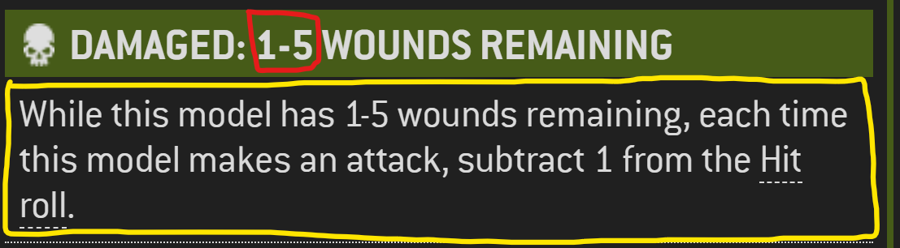
link: link to the datasheet on wahapedia

## Datasheets_abilities
Has the informaiton on which abilties a datasheet has and in which order they are displayed

datasheet_id: the id of the datasheet, refferencing the datasheet tabel 
line: the order the abilities is displayed in starting with 1. faction adn core are writtne on the same line.
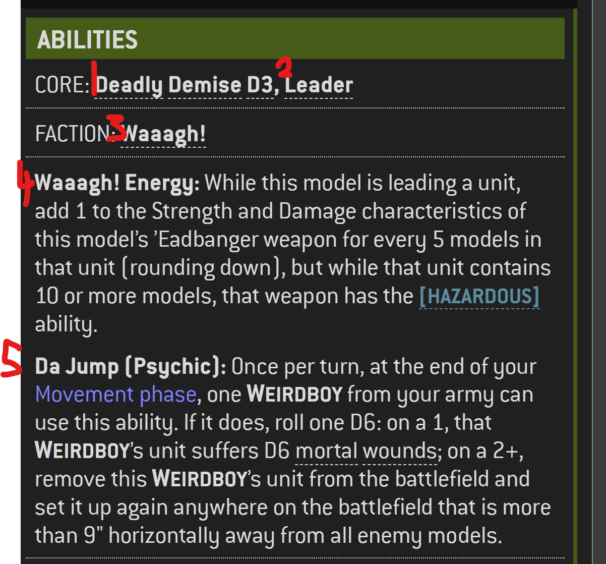
ability_id: the id of the ability if its a non datasheet ability, e.g. faction. if this is filed use the data from the abillityes tabel 
model: Belonging of this ability to a specific model of the datasheet. This dosent seem relevant since there isent any one that has it.
name: name of the ability
description: the descreption of the ability
type: the type of the ability, core, faction, datasheet 
parameter: the paramter of the ability if its applicable
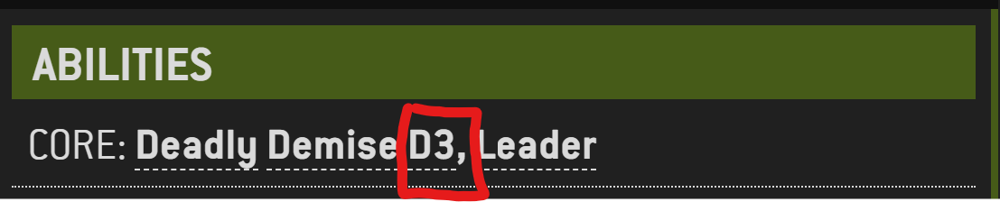

## Datasheets_keywords.csv
Has the information on what keywords wich models on a datasheet has, both regular and faction.

datasheet_id: the id of the datasheet, refferencing the datasheet tabel 
keyword: the keyword
model: what models on the datasheet a keyword is applicable for. 
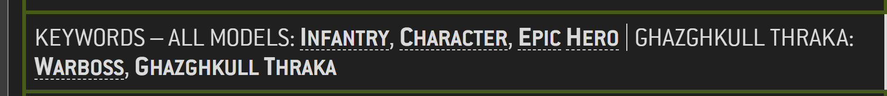
is_faction_keyword: a bool if its a faction keyword or not.

## Datasheets_models.csv
Has the information on the stats of the models in a datasheet, most of the time there is only one type of model but ther can acure multipel.

datasheet_id: the id of the datasheet, refferencing the datasheet tabel 
line: at what line the models info is displayed at, starting at 1
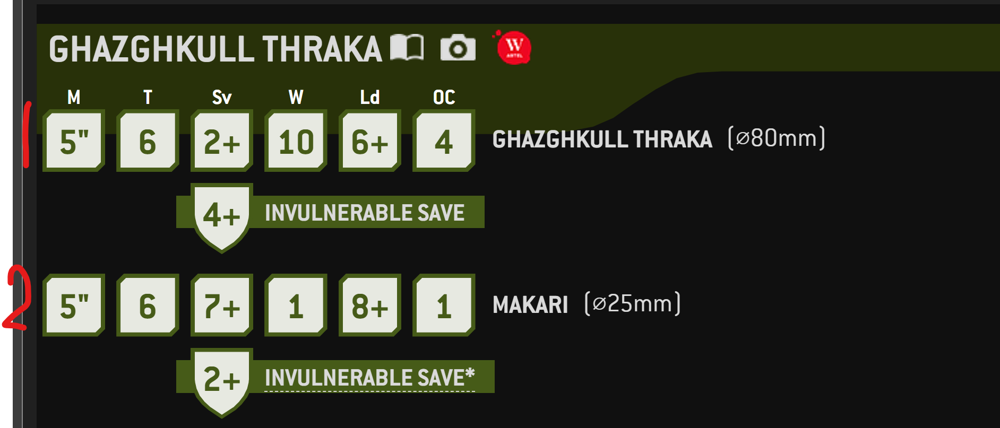
name: the name of the model
M: the movment characteristic of the model
T: the thoughness characteristic of the modle
Sv: the saving through characteristic of the modle
inv_sv: if applicable, the invul saving through characteristic of the modle
inv_sv_descr if applicable the descreption for the invul saving through e.g. "You cannot re-roll invulnerable saving throws made for this model."
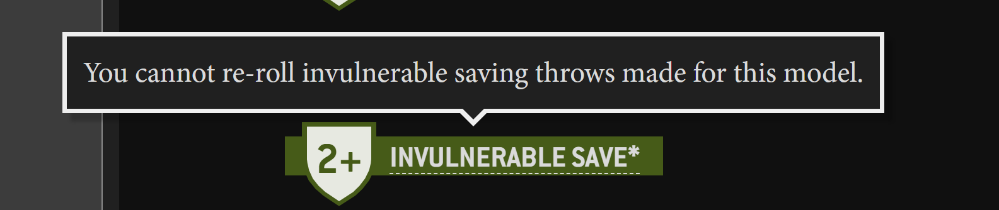
W: the wound characteristic of the modle
Ld: the leadership characteristic of the modle
OC: the objective control characteristic of the modle
base_size: the base size of the physical model
base_size_descr: the descreption of the base size 

## Datasheets_options.csv
This describes the avilable, wargear for a datasheet

datasheet_id: the id of the datasheet, refferencing the datasheet tabel 
line: the line its displayed at
button: the icon for the line
description: the descreption for the line, in html format
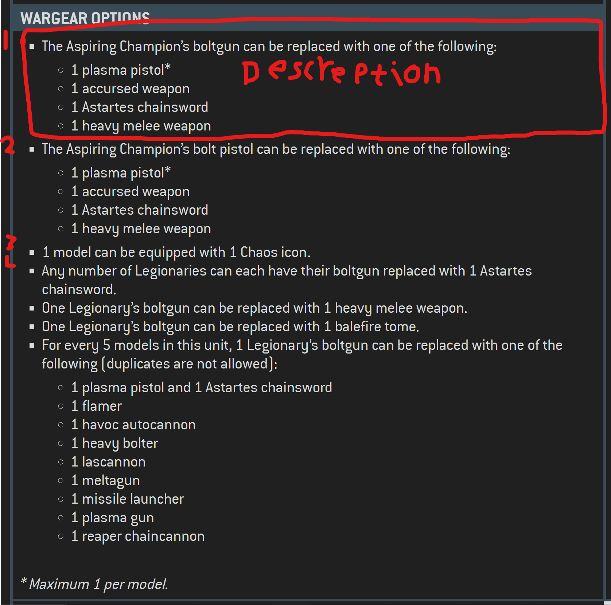

## Datasheets_wargear.csv
This table describes the diffrent wargear a given datasheet has access to

datasheet_id: the id of the datasheet, refferencing the datasheet tabel 
line: at what line the wargear is at, starting at 1
line_in_wargear: for wargear that has different options, starting at 1
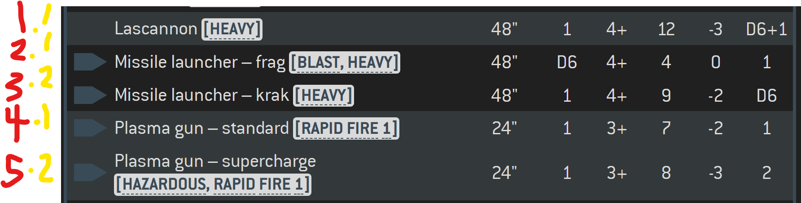
dice: if dice is required to chose the wargear option
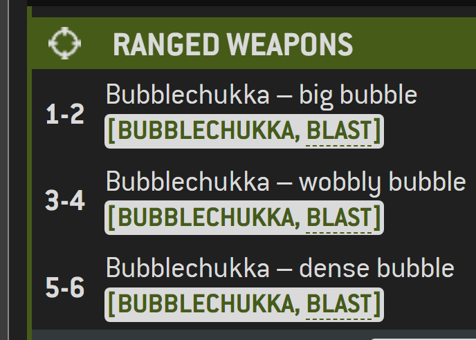
name: the name of the wargear
description: the rules of the wargear, mostly keywords, written in html format
range: range of the wargear, "Melee" if its melee
type: the weagear type, "Ranged" or "Melee"
A: number of attacks
BS_WS: Balistic skill for ranged weapons and weapon skill for melee
S: streght characteristc of the wargear
AP: armor penetration characteristc of the wargear
D: the damage characteristc of the wargear
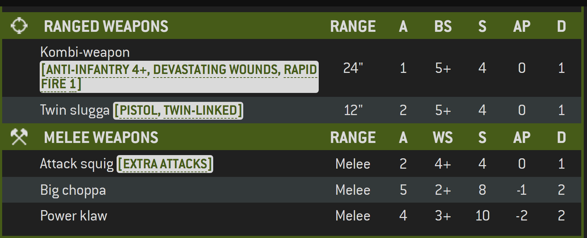

## Datasheets_unit_composition.csv
This table describes the unit composition for a given datasheet

datasheet_id: the id of the datasheet, refferencing the datasheet tabel 
line: at what line its displayed at starting at 1
description: the unit composition
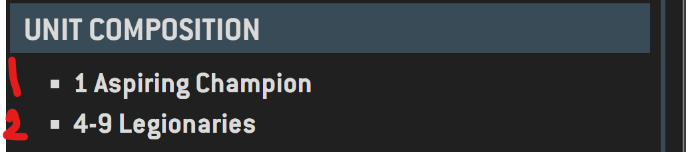

## Datasheets_models_cost.csv
This table describes what the model combination and cost is for a given datasheet

datasheet_id: the id of the datasheet, refferencing the datasheet tabel 
line: at what line its displayed at starting at 1
description: model descreption
cost: the models cost
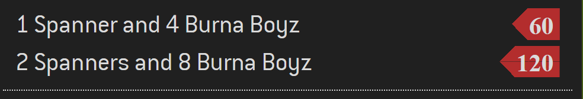

## Datasheets_stratagems.csv
This table describes what stratagems a given datasheet has acces to

datasheet_id: the id of the datasheet, refferencing the datasheet tabel 
stratagem_id the id of the stratagem, refferencing the stratagem table

## Datasheets_enhancements.csv
This table describes what enhacmnets a given datasheet has access to

datasheet_id: the id of the datasheet, refferencing the datasheet tabel 
enhancement_id: the id of the enhacement, refferencing the enhancment table
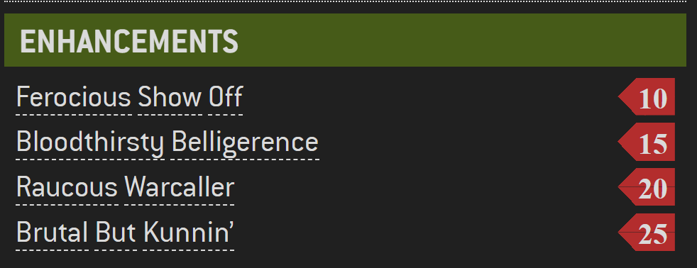

## Datasheets_detachment_abilities.csv
This table describes what detachment abilities a datasheet has accses to

datasheet_id: the id of the datasheet, refferencing the datasheet tabel 
detachment_ability_id: the id of the detachment ability, refferencing the detachment ability tabel
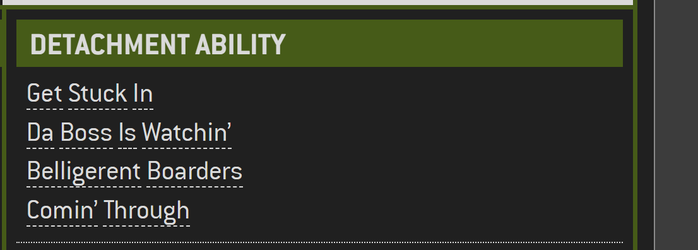

## Datasheets_leader.csv
This table describes what units can lead which units

datasheet_id: the datasheet id of the leader, refferencing the datasheet table 
attached_datasheet_id: the datasheet id of the unit it can lead, refferencing the datasheet table
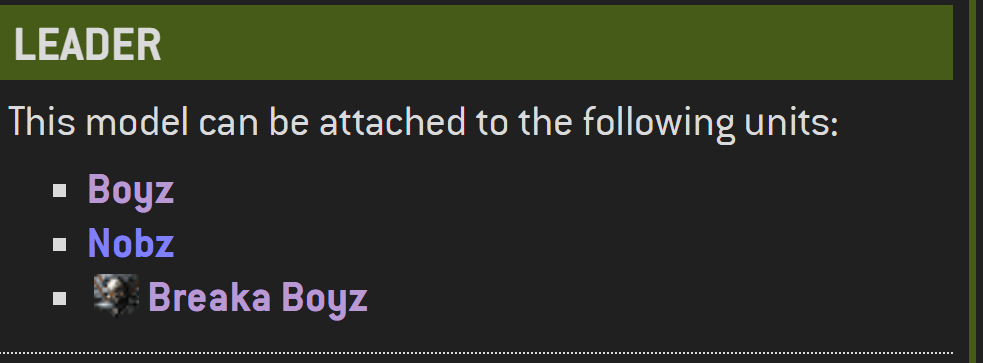
use it the other way around to get the led by relation.
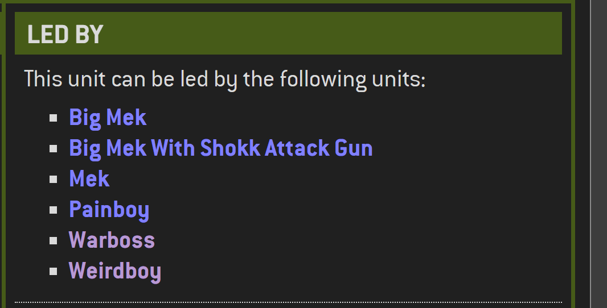

## Stratagems.csv
This table describes the diffrent strategems there is in a detachment

id: the id of the stratagem
faction_id: the faction id, refferencing the faction table, if this is empty, its a core stratagem
name: the name of the stratagem, in all caps
type: the type of the stragem on the following format "\<name of the detachment\> - \<the actual type of the stratagem\>"
cp_cost: the cp cost of the strategme
legend: fluff text irelevant
turn: In what turn the strategem can be used, "Your turn", "Either player’s turn", "Opponent’s turn"
phase: what phase the stratagem can be used in "Command phase", "Shooting phase", "Fight phase", "Movement phase", "Charge phase"
description: the descreption of what the stragem does, written in html format.
detachment: The name of the detacmneht the stratgem is attached to

## Abilities.csv
This table describes the faction abillities, there are multipel abillities that have the same id, thus making the primary key the id and the faction_id
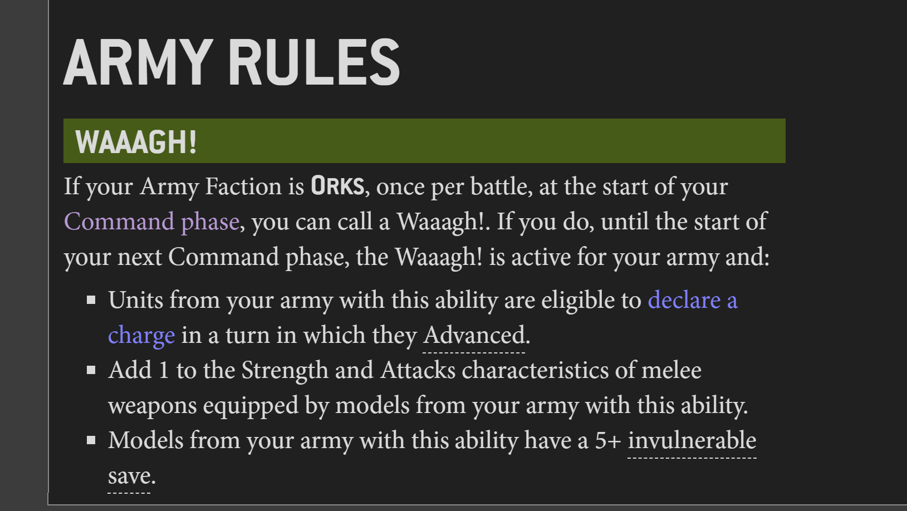

id: the id of the billity
name: the name of the abillity
legend: fluff text
faction_id: the id of the connected faction, refferencing the faction table
description: the descreption of the abillity

## Enhancements.csv
This table describes the diffrent enhacmnet that can be choseed for the diffrent detachments

id: the id of the enhacment
faction_id: the id of the faction the ehancment is connected to, refferencing the faction table
name: the name of the enhacmnet
legend: fluff text
description: descrpetion of what the enhacmnet does, written in  html format
cost: the points cost of the enhacmnet
detachment: the detachment its connected to

## Detachment_abilities.csv
This table describes the abilities of the different detachments

id: the id of the detachment
faction_id: the of the connected faction, reffrecing the faction table
name: the name of the detachment abillity
legend: fluff text
description: what the detachment does, written in html format
detachment: the name of the detachment, there can be multipel with the same name
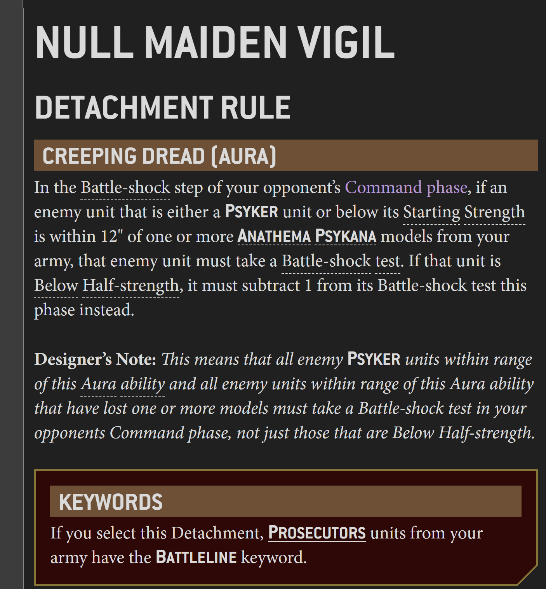

## Last_update.csv
last_update
